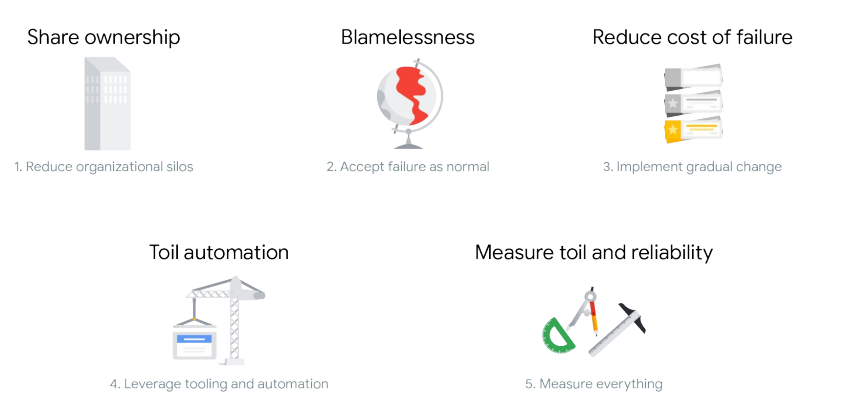

# SRE-Practices

Here are some SRE practices followed by Google Developers.

## Principles 
---
> Developing an SRE Culture 👨🏻‍💻👩🏻‍💻
1. Customers’ experiences with your service tell you how reliable it is.
2. In many IT organizations, development and operations teams have
conflicting priorities.
3. Site Reliability Engineering (SRE) is the practice of balancing the
velocity of development features with the risk to reliability.

4. SRE can benefit IT teams, regardless of whether they are using cloud
or on-premises technology, for both large projects and daily work.

> Why DevOps & SRE required 💪🏻

1. SRE can benefit IT teams, regardless of whether they are using cloud
or on-premises technology, for both large projects and daily work.
2. DevOps is a philosophy, not a development methodology or
technology.
3. SRE is a practical way to implement DevOps philosophy.
4. Developers focus on feature velocity and innovation; operators focus
on reliability and consistency.
5. SRE consists of both technical and cultural practices.
6. SRE practices align to DevOps pillars:

    

> SLOs with Consequences 🤔
* **Blameless postmortem:** Detailed documentation of an incident or
outage, its root cause, its impact, actions taken to resolve it, and
follow-up actions to prevent its recurrence.
* **Reliability:** The number of “good” interactions divided by the number
of total interactions. This leaves you with a numerical fraction of real
users who experience a service that is available and working.
* **Error budget:** The amount of unreliability you are willing to tolerate.
* **Service level indicator (SLI):** A quantifiable measure of the reliability
of your service from your users' perspective.
* **Service level objective (SLO):** Sets the target for an SLI over a period
of time.

    ### *Key Notes:*

1. The mission of SRE is to protect, provide for, and progress software
and systems with consistent focus on availability, latency,
performance, and capacity.
2. Understanding SRE practices and norms will help you build a
common language to use when speaking with your IT teams and
support your organization’s adoption of SRE both in the short and
long term.
3. Experienced SREs are comfortable with failure.
4. Failures are documented in postmortems, which focus on systems
and processes versus people.

5. 100% reliability is the wrong target because it slows the release of
new features, which is what drives your business.

> Make Tomorrow Better Than Today 👍

* **Continuous integration:** Building, integrating, and testing code
within the development environment.
* **Continuous delivery:** Deploying to production frequently, or at the
rate the business chooses.
* **Canarying:** Deploying a change in service to a group of users who
don’t know they are receiving the change, evaluating the impact to
that group, and then deciding how to proceed.
* **Toil:** Work directly tied to a service that is manual, repetitive,
automatable, tactical, or without enduring value, or that scales
linearly as the service grows. 

    ### *Key Notes:*

1. Change is best when small and frequent.
2. Design thinking methodology has five phases: empathize, define,
ideate, prototype, and test.
3. Prototyping culture encourages teams to try more ideas, leading to an
increase in faster failures and more successes.
4. Excessive toil is toxic to the SRE role.
5. By eliminating toil, SREs can focus the majority of their time on work
that will either reduce future toil or add service features.
6. Resistance to change is usually a fear of loss.

7. Present change as an opportunity, not a threat.
8. People react to change in many ways, and IT leaders need to
understand how to communicate with and support each group.

> Regulate Workload ⚙️

* **Affinity bias:** Tendency to gravitate toward those who are similar to
you, such as with race, gender, socioeconomic background, or
education level.
* **Confirmation bias:** Tendency to find information, input, or data that
supports your preconceived notions.
* **Selective attention bias:** Tendency to pay attention to things, ideas,
and input from people whom you tend to gravitate toward.
* **Labeling bias:** Tendency to form opinions based on how people look,
dress, or appear externally.

    ### *Key Notes:*

1. Measure reliability with good service level indicators (SLIs).
2. A good SLI correlates with user experience with your service; that is, a
good SLI tells you when users are happy or unhappy.
3. Measure toil by identifying it, selecting an appropriate unit of
measure, and tracking the measurements continuously.
4. Monitoring allows you to gain visibility into a system, which is a core
requirement for judging service health and diagnosing your service
when things go wrong.

5. Goal-setting, transparency, and data-driven decision making are key
components of SRE measurement culture.
6. To make truly data-driven decisions, you need to remove any
unconscious biases. 

> Apply SRE in Your Organization

1. **Kitchen Sink/”Everything SRE” team:** We recommend this approach
for organizations that have few applications and user journeys and
where the scope is small enough that only one team is necessary, but
a dedicated SRE team is needed in order to implement its practices.
2. **Infrastructure team:** This type of team focuses on maintaining shared
services and components related to infrastructure, versus an SRE
team dedicated to working on services related to products, like
customer-facing code.
3. **Tools team:** This type of SRE team tends to focus on building
software to help their developer counterparts measure, maintain, and
improve system reliability or other aspects of SRE work, such as
capacity planning.
4. **Product/Application team:** This type of SRE team works to improve
the reliability of a critical application or business area. We
recommend this implementation for organizations that already have a
Kitchen Sink, Infrastructure, or Tools-focused SRE team and have a
key user-facing application with high reliability needs.
5. **Embedded team:** This team has SREs embedded with their developer
counterparts, usually one per developer team in scope. The work
relationship between the embedded SREs and developers tends to be
project- or time-bounded and usually very hands-on, where they
perform work like changing code and configuration of the services in
scope.
6. **Consulting team:** This implementation is very similar to the
embedded implementation, except SRE are usually less hands-on. We
recommend staffing one or two part-time consultants before you staff
your first SRE team.

7. Organizations with high SRE maturity have well-documented and
user-centric SLOs, error budgets, blameless postmortem culture, and
a low tolerance for toil.
8. Engineers with operations experience and systems administrators
with scripting experience are good first SREs to hire.
9. Upskill current team members with necessary SRE skills such as
operations and software engineering, monitoring systems, production
automation, system architecture, troubleshooting, culture of trust, and
incident management.
10. Contact your Account Executive or Account Director to learn how the
Google Cloud Professional Services team can support your
organization’s adoption of SRE.